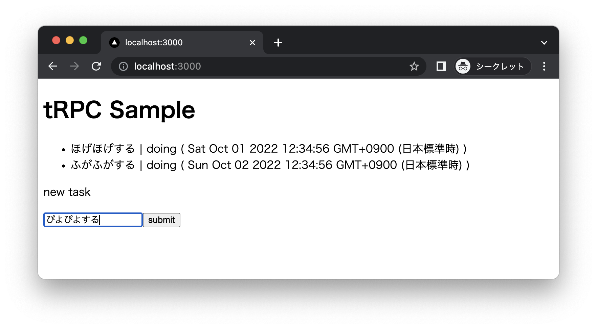
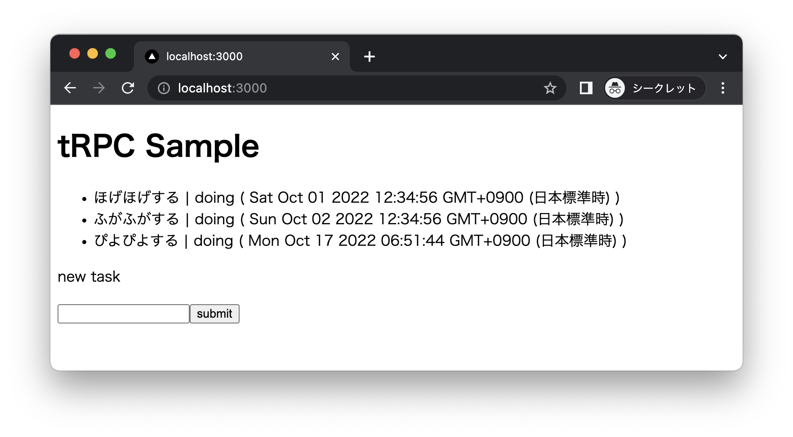

# tRPC Sample
## Requirements
- node 16 or nodenv
- sqlite3

## Setup
Database migration

```
$ make db-init
```

## Run
Boot development server

```
$ npm install
$ make up
```

Open http://localhost:3000

## Screen shot




## Branches
- [main](https://github.com/suzuki-hoge/trpc-sample/tree/main)
- [growth](https://github.com/suzuki-hoge/trpc-sample/tree/growth)
- [diff main..growth](https://github.com/suzuki-hoge/trpc-sample/compare/main..growth)

